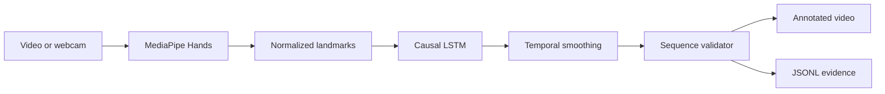

# Real-Time Assembly Task Validation POC

A portfolio-ready computer-vision POC that recognizes industrial assembly
actions from hand-joint trajectories and validates their order with a
deterministic state machine.

This repository is designed for the public
[HATREC video dataset](https://www.kaggle.com/datasets/ayoznur/hatrec-video-dataset)
and follows the high-level direction of the associated
[IEEE Access paper](https://doi.org/10.1109/ACCESS.2025.3554263).

> **Scope:** this is an action-recognition and sequence-validation research
> POC. It does not prove torque, component orientation, fastening quality, or
> final product quality, and it is not a production safety system.

## Pipeline



The repository deliberately contains no private industrial material and no
copy of the HATREC dataset.

## What is implemented

- Manifest-driven video ingestion with optional temporal segments.
- MediaPipe extraction for two hands: 21 normalized 3D joints per hand.
- Fixed-length streaming windows with missing-hand masks.
- A lightweight unidirectional PyTorch LSTM classifier.
- Confidence smoothing and consecutive-window confirmation.
- Detection of correct, repeated, skipped/out-of-order and unexpected actions.
- Video/webcam inference with an OpenCV status overlay.
- JSONL event evidence and an annotated MP4 output.
- Unit tests and GitHub Actions CI.

## 1. Environment

```bash
python -m venv .venv
source .venv/bin/activate
python -m pip install --upgrade pip
python -m pip install -e ".[dev]"
```

CUDA is optional. Install the appropriate PyTorch build first if you want GPU
training or inference.

## 2. Download HATREC

Accept the dataset terms on Kaggle, configure the Kaggle CLI, then run:

```bash
kaggle datasets download \
  -d ayoznur/hatrec-video-dataset \
  -p data/raw --unzip
```

The dataset is listed as **CC BY-NC-ND 4.0**. Do not commit or redistribute
videos, extracted frames, modified clips, or annotations. Review the dataset
page before publishing model weights or demo footage.

## 3. Create a manifest

Copy `data/manifest.example.csv` to `data/manifest.csv` and add one row per
action clip or annotated temporal segment:

```csv
video_path,label,split,start_sec,end_sec
data/raw/example.mp4,task_01,train,0.0,4.2
```

Splits should be made by complete operator/session, not by random frames, to
avoid temporal data leakage.

## 4. Extract streaming windows

```bash
assembly-prepare \
  --manifest data/manifest.csv \
  --output data/processed \
  --window-size 45 \
  --stride 10
```

Each sample is stored as `[time, 128]`: two hands × 21 joints × xyz plus two
presence masks.

## 5. Train

```bash
assembly-train \
  --index data/processed/index.csv \
  --output artifacts/action_lstm.pt \
  --epochs 30
```

The checkpoint stores the model configuration and class names. Training also
writes a JSON metrics file next to the checkpoint.

## 6. Configure the procedure

Edit `configs/hatrec_sequence.yaml` so `expected_sequence` exactly matches the
labels and correct task order in your manifest.

## 7. Run video or webcam inference

```bash
assembly-infer \
  --source path/to/test_video.mp4 \
  --model artifacts/action_lstm.pt \
  --procedure configs/hatrec_sequence.yaml \
  --output outputs/demo
```

Use `--source 0` for a webcam. The output directory contains:

- `annotated.mp4` — recognized/expected action and OK/NG overlay.
- `events.jsonl` — timestamped validation evidence.
- `run_summary.json` — accepted steps, errors, FPS and configuration.

## Recommended evaluation

Report macro-F1 and per-class recall for recognition; event-level precision,
recall and latency for task events; error-detection recall and false-NG rate
for sequence validation; and end-to-end FPS on the target hardware.

Create abnormal test manifests by referencing clips in skipped, repeated or
reordered sequences. Do not create and redistribute modified HATREC videos.

## Portfolio-safe demonstration

Use HATREC only according to its license. For a LinkedIn video, the safest
approach is to record your own simple seven-step assembly reenactment and show
the trained pipeline running on that footage. Describe the result as a
**research POC**, not as a production inspection system.

## Roadmap

- [ ] Audit the exact HATREC annotations and populate the manifest.
- [ ] Train and publish reproducible baseline metrics.
- [ ] Add an optional object/tool detection branch where annotations permit.
- [ ] Export the temporal model to ONNX/TensorRT for Jetson benchmarking.
- [ ] Add event-level confusion analysis and latency plots.

## License

The source code in this repository is MIT licensed. The HATREC dataset has its
own separate license and is not distributed here.

